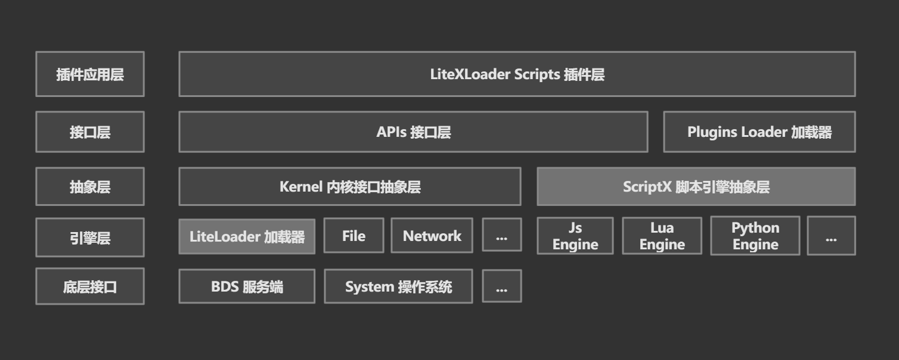

## 👓 Project Architecture Analysis

> `LiteLoader` is a plugin framework for the official `Bedrock Dedicated Server` (hereinafter referred to as **BDS**) of Bedrock Edition, providing powerful cross-language scripting plugin support and stable development API support.

As mentioned in the project introduction, LiteLoader is a BDS server-side plugin framework with cross-language and cross-platform capabilities.

### Cross-Language Development Capabilities

At the beginning of LLSE development, the idea was to rely on the support of cross-language engines, integrate multiple scripting languages, and provide a unified development interface to solve the problem of fragmented development ecology.
In the actual project, using the cross-language engine of Tencent's open source project `ScriptX`, while connecting to various backends, ScriptX exports a unified C++ interface.
Therefore, LLSE only maintains one set of low-level interfaces when docking with BDS, which is quite convenient for docking with script engines.
Currently, `ScriptX` is still under development, and new language support will take time, so let's wait and see.

<br>

### Modularity, Compatibility

The most important idea of ​​LLSE is to modularize important functions to facilitate subsequent maintenance and sub-project upgrades. Based on the modular design idea, LLSE separates the underlying loader interface, multiple script engine backends, and plug-in loading modules from each other to ensure that each part can be maintained and upgraded independently, and the coupling between each module is minimized to facilitate modification and new functions.

The architecture of `LiteLoader ScriptEngine` can be seen at a glance from this figure:



- `LiteLoader` and `ScriptX` provide important basic interfaces.
- Kernel kernel abstraction layer is responsible for all calls to `LiteLoader` API, Hook function calls and calls to other underlying library functions, and abstracts their respective types into standard variable types and STL containers, and encapsulates their respective interfaces to avoid Strong dependencies on underlying projects spread to upper layers.
- The API interface layer provides an API interface for the ScriptX scripting engine. The engine injects the API into the scripting system. In the script, the relevant API interface is called to complete the interaction with the BDS.
- ScriptX completes the unified abstraction of the lower-level script engine, provides a consistent interface at the upper level, and provides a foundation for cross-language script development.

At the same time, due to the use of C/C++ language development, the `LiteLoader` loader can also use **Wine** to support operation on Linux, all functions can still work normally, and the running performance is significantly higher than the original Linux BDS. Developers using Linux don't have to worry about platform compatibility.

<br>

### Introduction to Open Source Project Directory Structure

The project is built using the MSBuild build system.  
The above architecture is implemented into the actual project, and the project directory structure is shown in the figure: 

```
├───docs				# Documentation Directory
├───ScriptEngine
│   ├───engine			# Script Engine Library Directory
│   ├───include			# Header file include directory
│   ├───lib				# Dependency library directory
│   ├───LiteLoader.Js	# JS Project Directory (No Source Code)
│   ├───LiteLoader.Lua	# Lua Project Directory (No Source Code)
│   ├───Release			# DLL Generation Directory
│   ├───src				# [Core]Source Directory
│   │   ├───API			# API Interface Layer
│   │   └───Kernel		# Core Abstractio Layer
│   └───test			# Test
├───RELEASE				# Release Directory (for GitHub Action)
└───ScriptX				# ScriptX Source Directory
```

<br>

### Important Underlying Principles

Regarding how to obtain the underlying interface from BDS, the methods of the major plug-in frameworks of BDS are similar: use Hook. There will be a lot of knowledge related to the bottom layer of the Windows operating system, which is one of the reasons why it is difficult to develop the C++ plug-in of BDS.

Hook technology refers to modifying the code in the BDS address space through some mechanisms when the BDS executes a function, so that it executes some of the developer's own code first, and then returns to the BDS to execute what it originally intended to execute. This way, developers can inject their own logic into BDS.

We can speculate on the reason for the original function being called, and respond to these events in our own code, such as calling other BDS functions, or logging to the database, or executing a command, or even intercepting this function to achieve the purpose of preventing this event from happening. All in all, it can achieve some behaviors that the original server cannot achieve through Hook.
